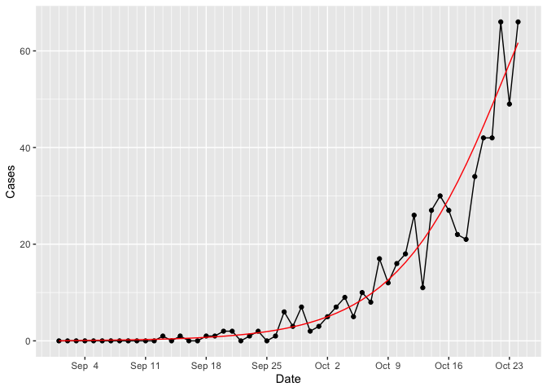
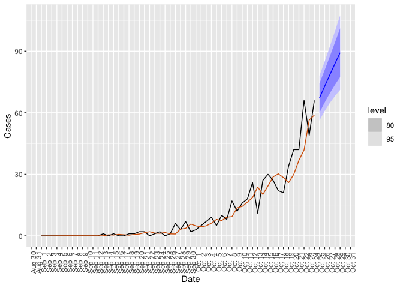

Generating a forecast from synthetic data
================

The first step (after installing the package) is to load the library
`epismthr`, along with other packages as shown below.

``` r
library(epismthr)
library(ggplot2)
library(dplyr)
library(fable)
```

Use the function `generate_cases()` to generate synthetic data, so that
we can test the forecasting algorithm.

``` r
all_data <- generate_cases()
all_data
```

    ## # A tibble: 101 × 4
    ##      Day Date        Model Cases
    ##    <int> <date>      <dbl> <dbl>
    ##  1     1 2023-09-01 0          0
    ##  2     2 2023-09-02 0.0281     0
    ##  3     3 2023-09-03 0.0706     0
    ##  4     4 2023-09-04 0.0958     0
    ##  5     5 2023-09-05 0.116      0
    ##  6     6 2023-09-06 0.135      0
    ##  7     7 2023-09-07 0.156      0
    ##  8     8 2023-09-08 0.180      1
    ##  9     9 2023-09-09 0.207      0
    ## 10    10 2023-09-10 0.238      1
    ## # ℹ 91 more rows

Get data from an earlier part of the epi curve in order to run a test.

``` r
test_data <- all_data %>%
  filter(Date <= as.Date("2023-10-24"))
```

Plot the SEIR model output and the generated data.

``` r
ggplot(test_data,aes(x=Date,y=Cases))+
  geom_line()+
  geom_point()+
  geom_line(aes(y=Model),colour="red")+
  scale_x_date(date_breaks = "1 week", minor_breaks = "1 day",date_labels="%b %e")
```

<!-- -->

Call the function `epi_forecast()` to generate the forecast, with a
look-ahead duration of seven days. A list containing result data is
returned.

``` r
result <- epi_forecast(test_data,
                       look_ahead = 7)
```

First, we can plot the forecast.

``` r
result$plot_fcast
```

<!-- -->

Next, we can plot information on the overall fit.

``` r
result$plot_comp
```

    ## Warning: Removed 1 row containing missing values (`geom_line()`).

<!-- -->

We can also access the forecast values and the confidence intervals.

``` r
result$hilo
```

    ## # A tsibble: 7 x 5 [1D]
    ##   Date        Mean Level Lower Upper
    ##   <date>     <dbl> <dbl> <dbl> <dbl>
    ## 1 2023-10-25  62.3    95  52.7  71.9
    ## 2 2023-10-26  65.4    95  55.5  75.2
    ## 3 2023-10-27  68.5    95  58.1  78.9
    ## 4 2023-10-28  71.5    95  60.1  82.8
    ## 5 2023-10-29  74.4    95  61.8  87.0
    ## 6 2023-10-30  77.3    95  63.1  91.5
    ## 7 2023-10-31  80.1    95  64.1  96.2
